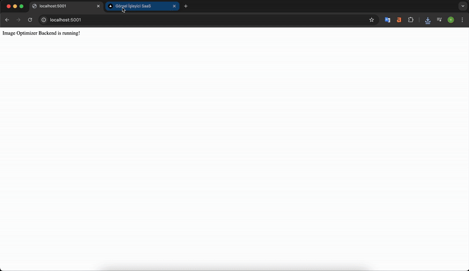

# Görsel Optimizasyon SaaS (Alt Text Generator & WebP Converter)



Bu proje, yüklenen görselleri optimize eden, otomatik alt metin (alt text) üreten ve WebP formatına dönüştüren bir demo SaaS uygulamasıdır. Google Cloud Vision API ile görsel içeriğine göre alt metin üretir, görseli WebP'ye çevirir ve kullanıcıya yeni dosya adıyla birlikte indirme imkanı sunar.

## Özellikler
- Görsel yükleme (jpeg, png, webp, gif, bmp)
- Google Vision AI ile otomatik alt metin üretimi
- WebP formatına dönüştürme ve sıkıştırma
- Yeni dosya adı ve alt metin ile indirme
- Alt metni kopyalama butonu
- Dosya boyutu limiti (5MB)
- Sadece görsel dosyalarına izin
- Modern ve responsive arayüz (Next.js + TailwindCSS)

## Kurulum
### 1. Backend
```bash
cd backend
npm install
```
- Google Cloud Vision API için bir servis hesabı oluşturup JSON anahtarını alın.
- `backend/.env` dosyası oluşturun ve aşağıdaki gibi doldurun:

```
GOOGLE_APPLICATION_CREDENTIALS=./google-credentials.json
PORT=5001
```

### 2. Frontend
```bash
cd frontend
npm install
npm run dev
```

## Kullanım
1. Frontend: `http://localhost:3000/upload` adresine gidin.
2. Bir görsel seçin ve yükleyin.
3. Optimize edilmiş görsel, alt metin ve indirme butonu ekranda gözükecek.

## Örnek Akış
- Görsel yüklenir → Backend görseli işler → Alt metin üretir → WebP'ye çevirir → Sonuçları frontend'e döner → Kullanıcı optimize görseli indirir veya alt metni kopyalar.

## .env Örneği
Aşağıdaki gibi bir dosya oluşturun:
```
GOOGLE_APPLICATION_CREDENTIALS=./google-credentials.json
PORT=5001
```

## Lisans
MIT

---

> Bu proje, portföy ve eğitim amaçlı hazırlanmıştır. Katkıda bulunmak veya öneri sunmak için PR gönderebilirsiniz!

